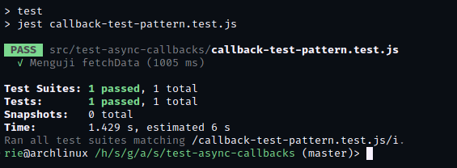

<h1>ToC</h1>

- [Dependencies](#dependencies)
- [Installation](#installation)
- [Callback with asnyc syntax?](#callback-with-asnyc-syntax)
- [Testing](#testing)
- [Callback Example](#callback-example)
  - [Node.js:](#nodejs)
  - [jQuery:](#jquery)
  - [Express.js:](#expressjs)
  - [Mongoose:](#mongoose)
- [Callback Hell](#callback-hell)
- [Promise](#promise)
- [Promisify](#promisify)
- [Chaining Promises](#chaining-promises)
- [Handling Promise Rejections](#handling-promise-rejections)
- [Promise.resolve and Promise.reject](#promiseresolve-and-promisereject)
- [Promise.all: Implementing From Scratch](#promiseall-implementing-from-scratch)
- [Await Keyword in JavaScript](#await-keyword-in-javascript)
- [Handling Errors Using Async Await](#handling-errors-using-async-await)
- [What About Task Priorities?](#what-about-task-priorities)

# Dependencies

   

# Installation

```shell
npm install
```

# Callback with asnyc syntax?

Seharusnya, ketika menggunakan callback dalam suatu function, tidak ada kebutuhan untuk menggunakan kata kunci `async`. Callback digunakan untuk menangani hasil asinkron, dan tidak ada kebutuhan untuk mengubah fungsi menjadi fungsi async.

# Testing

```javascript
const { test, expect } = require("@jest/globals");

function fetchData(callback) {
  setTimeout(() => {
    const data = "Data yang diterima";
    callback(data);
  }, 1000);
}

test("Menguji fetchData", (done) => {
  fetchData((data) => {
    expect(data).toBe("Data yang diterima");
    done();
  });
});
```



# Callback Example

Callback digunakan secara luas dalam banyak pustaka (libraries) JavaScript untuk menangani operasi asynchronous atau peristiwa-peristiwa tertentu. Berikut adalah beberapa contoh penggunaan callback dalam pustaka-pustaka JavaScript populer:

### Node.js:

Dalam lingkungan Node.js, banyak fungsi bawaan menggunakan pola callback untuk menangani operasi asynchronous.

Sebagai contoh, dalam fungsi `readFile` dari modul `fs`, anda dapat memberikan callback sebagai argumen untuk menangani hasil pembacaan file.

```javascript
const fs = require("fs");

fs.readFile("file.txt", "utf8", (error, data) => {
  if (error) {
    console.error("Terjadi kesalahan:", error);
  } else {
    console.log("Isi file:", data);
  }
});
```

### jQuery:

jQuery menggunakan callback dalam berbagai metode untuk menangani operasi asynchronous atau peristiwa seperti animasi, permintaan AJAX, atau peristiwa DOM.

Contoh penggunaan callback dalam metode `fadeIn` untuk menangani animasi setelah selesai:

```javascript
$("#element").fadeIn("slow", () => {
  console.log("Animasi fadeIn selesai");
});
```

### Express.js:

Express.js, framework web populer di Node.js, juga menggunakan callback untuk menangani permintaan HTTP dan middleware.

Contoh penggunaan callback dalam penanganan rute HTTP:

```javascript
const express = require("express");
const app = express();

app.get("/route", (req, res) => {
  res.send("Hello, World!");
});
```

### Mongoose:

Mongoose adalah pustaka ODM (Object-Document Mapper) untuk MongoDB, dan juga menggunakan callback dalam berbagai operasi database asynchronous.

Contoh penggunaan callback dalam operasi `findOne`:

```javascript
const mongoose = require("mongoose");

const userSchema = new mongoose.Schema({
  name: String,
  email: String,
});

const User = mongoose.model("User", userSchema);

User.findOne({ name: "John" }, (error, user) => {
  if (error) {
    console.error("Terjadi kesalahan:", error);
  } else {
    console.log("Data pengguna:", user);
  }
});
```

Pustaka-pustaka JavaScript lainnya, seperti Axios, Lodash, Async.js, dan banyak lagi, juga menggunakan callback dalam berbagai cara untuk menangani operasi asynchronous atau peristiwa tertentu. Callback memberikan fleksibilitas untuk menentukan logika yang akan dijalankan setelah operasi asynchronous selesai atau peristiwa terjadi.

# Callback Hell

Contoh Callback Hell:

```javascript
getDataA((resultA) => {
  processDataA(resultA, (resultB) => {
    getDataB(resultB, (resultC) => {
      processDataC(resultC, (finalResult) => {
        console.log(finalResult);
      });
    });
  });
});
```

Contoh penggunaan Promises untuk menghindari Callback Hell:

```javascript
getDataA()
  .then((resultA) => {
    // Melakukan tindakan setelah Promise A terpenuhi
    return processDataA(resultA);
  })
  .then((resultB) => {
    // Melakukan tindakan setelah Promise B terpenuhi
    return getDataB(resultB);
  })
  .then((resultC) => {
    // Melakukan tindakan setelah Promise C terpenuhi
    return processDataC(resultC);
  })
  .then((finalResult) => {
    // Melakukan tindakan setelah semua Promise terpenuhi
    console.log(finalResult);
  })
  .catch(function (error) {
    // Menangani kesalahan jika terjadi
    console.error(error);
  });
```

versi clean code:

```javascript
try {
  const resultA = await getDataA();
  const resultB = await processDataA(resultA);
  const resultC = await getDataB(resultB);
  const finalResult = await processDataC(resultC);
  console.log(finalResult);
} catch (error) {
  console.error(error);
}
```

Dalam kode di atas, async/await digunakan untuk menghindari penggunaan beruntun fungsi .`then()` dan menggantinya dengan struktur yang lebih sekuensial. Penanganan kesalahan dilakukan dengan menggunakan blok `try-catch`, sehingga kesalahan dapat ditangani dengan lebih jelas dalam blok catch.

# Promise

Untuk membuat sebuah Promise dalam JavaScript, anda dapat menggunakan constructor `Promise`. Constructor `Promise` menerima satu argumen, yaitu fungsi eksekutor (executor function). Fungsi eksekutor tersebut memiliki dua parameter, yaitu `resolve` dan `reject`, yang merupakan fungsi yang digunakan untuk mengubah keadaan Promise menjadi terpenuhi (fulfilled) atau ditolak (rejected).

Berikut adalah contoh sederhana untuk membuat sebuah Promise:

```javascript
const myPromise = new Promise((resolve, reject) => {
  // Logika operasi asynchronous di sini

  // Jika operasi asynchronous berhasil
  // Memanggil resolve dengan hasil yang diinginkan
  resolve("Data yang diterima");

  // Jika operasi asynchronous gagal
  // Memanggil reject dengan alasan kesalahan
  // reject('Terjadi kesalahan');
});
```

Dalam contoh di atas, kita membuat sebuah Promise menggunakan constructor `Promise`. Dalam fungsi eksekutor, kita menempatkan logika operasi asynchronous yang ingin kita lakukan. Jika operasi asynchronous berhasil, kita memanggil fungsi `resolve` dengan hasil yang diinginkan, sedangkan jika operasi asynchronous gagal, kita memanggil fungsi `reject` dengan alasan kesalahan.

Setelah Promise dibuat, kita dapat menggunakan metode `.then()` dan `.catch()` untuk menentukan tindakan yang akan diambil ketika Promise terpenuhi atau ditolak. Misalnya:

```javascript
myPromise
  .then((data) => {
    console.log(data); // Menampilkan data yang diterima
  })
  .catch((error) => {
    console.error(error); // Menampilkan alasan kesalahan jika Promise ditolak
  });
```

Dalam contoh ini, kita menggunakan metode `.then()` untuk menentukan tindakan yang akan diambil ketika Promise terpenuhi, yaitu mencetak data yang diterima. Jika Promise ditolak, maka akan menjalankan metode `.catch()` dan mencetak alasan kesalahan.

Dalam prakteknya, fungsi eksekutor pada constructor `Promise` sering kali merupakan tempat di mana operasi asynchronous, seperti pemanggilan HTTP atau operasi berbasis file, dilakukan. Setelah operasi asynchronous selesai, fungsi `resolve` atau `reject` akan dipanggil untuk mengubah keadaan Promise sesuai dengan hasilnya.

# Promisify

Promisification adalah proses mengubah fungsi JavaScript yang menggunakan pola callback menjadi fungsi yang mengembalikan Promise. Ini memungkinkan kita untuk menggunakan pola penggunaan Promise yang lebih konsisten dalam kode kita.

1. Identifikasi fungsi yang akan dipromisifikasi:

   - Pilih fungsi yang menggunakan pola callback.
   - Pastikan fungsi tersebut mengikuti konvensi umum dalam pemrograman JavaScript di mana callback adalah argumen terakhir dalam daftar argumen.

2. Buat fungsi baru yang mempromisifikasi fungsi tersebut:
   - Buat fungsi baru yang mengembalikan Promise.
   - Di dalam fungsi baru, gunakan pola `resolve` dan `reject` untuk mengontrol keadaan Promise.
   - Panggil fungsi yang asli dengan menggunakan callback, dan terima hasilnya.
   - Di dalam callback, gunakan `resolve` untuk mengubah Promise menjadi terpenuhi dengan hasilnya, atau `reject` untuk menolak Promise dengan alasan kesalahan.

Berikut adalah contoh implementasi sederhana untuk mempromisifikasi fungsi `fs.readFile` yang ada dalam modul `fs` di Node.js:

```javascript
const fs = require("fs");

function readFileAsync(filename) {
  return new Promise((resolve, reject) => {
    fs.readFile(filename, "utf8", (error, data) => {
      if (error) {
        reject(error);
      } else {
        resolve(data);
      }
    });
  });
}
```

Dalam contoh ini, kita membuat fungsi `readFileAsync` yang mempromisifikasi `fs.readFile`. Fungsi `readFileAsync` mengembalikan Promise yang memungkinkan kita untuk mengonsumsi hasilnya dengan menggunakan `.then()` dan `.catch()`.

Setelah fungsi dipromisifikasi, kita dapat menggunakannya dengan cara berikut:

```javascript
readFileAsync("file.txt")
  .then((data) => {
    console.log("Isi file:", data);
  })
  .catch((error) => {
    console.error("Terjadi kesalahan:", error);
  });
```

Dalam contoh ini, kita memanggil `readFileAsync` yang mengembalikan Promise, dan kemudian menggunakan `.then()` dan `.catch()` untuk mengonsumsi hasilnya. Di dalam blok `.then()`, kita mencetak isi file yang diterima. Jika terjadi kesalahan, kita menangani penolakan Promise di blok `.catch()`.

Dengan mempromisifikasi fungsi, kita dapat menggunakan Promises secara konsisten dalam kode kita, menghindari pola callback hell, dan mengelola operasi asynchronous dengan lebih baik.

Penting untuk dicatat bahwa tidak semua fungsi JavaScript dapat dengan mudah dipromisifikasi. Beberapa fungsi memerlukan pengaturan dan penyesuaian lebih lanjut. Dalam beberapa kasus, pustaka khusus seperti `util.promisify` di Node.js dapat digunakan untuk mempromisifikasi fungsi secara otomatis.

# Chaining Promises

Chaining Promises adalah teknik di mana kita menggabungkan beberapa Promise secara berurutan, sehingga output dari Promise pertama menjadi input untuk Promise selanjutnya. Hal ini memungkinkan kita untuk mengatur alur eksekusi operasi asynchronous dengan lebih terstruktur dan membaca.

Berikut adalah langkah-langkah untuk melakukan Chaining Promises:

1. Membuat Promise pertama:

   - Buat Promise pertama menggunakan constructor `Promise`.
   - Di dalam fungsi eksekutor Promise, lakukan operasi asynchronous yang diinginkan.
   - Gunakan `resolve` untuk mengisi Promise dengan hasil operasi asynchronous atau `reject` jika terjadi kesalahan.

2. Menggunakan `.then()`:

   - Setelah Promise pertama terpenuhi, kita dapat menggunakan `.then()` untuk menentukan tindakan yang akan diambil ketika Promise terpenuhi.
   - Di dalam `.then()`, kita menerima argumen hasil dari Promise pertama dan melakukan tindakan yang diinginkan.
   - Kita juga dapat mengembalikan nilai dari `.then()`, yang akan menjadi input untuk `.then()` selanjutnya dalam rantai Promise.

3. Menggunakan `.catch()`:
   - Jika terjadi penolakan (rejection) dalam rantai Promise, kita dapat menggunakan `.catch()` untuk menangani penolakan tersebut.
   - Di dalam `.catch()`, kita dapat menangani kesalahan yang terjadi dan mengambil tindakan yang sesuai.

Berikut adalah contoh penggunaan Chaining Promises:

```javascript
function chainingPromises() {
  return new Promise((resolve, reject) => {
    setTimeout(() => {
      const data = "Data dari promise pertama";
      resolve(data);
    }, 1000);
  });
}

chainingPromises()
  .then((data) => {
    console.log("Promise pertama terpenuhi =>", data);

    return "Data dari promise kedua";
  })
  .then((data) => {
    console.log("Promise kedua terpenuhi =>", data);
    throw new Error("Terjadi kesalahan");
  })
  .catch((err) => {
    console.error("Terjadi kesalahan", err);
  });
```

Dalam contoh ini, kita membuat Promise pertama menggunakan fungsi `fetchData` yang mengembalikan Promise dengan hasil "Data dari Promise pertama". Setelah itu, kita menggunakan `.then()` untuk menentukan tindakan selanjutnya ketika Promise pertama terpenuhi.

Di dalam `.then()` pertama, kita mencetak hasil dari Promise pertama dan mengembalikan "Data dari Promise kedua". Nilai ini kemudian menjadi input untuk `.then()` kedua dalam rantai Promise. Di dalam `.then()` kedua, kita mencetak hasil dari Promise kedua dan melempar sebuah kesalahan.

Karena terjadi penolakan (rejection) dalam `.then()` kedua, kita menangani penolakan tersebut menggunakan `.catch()`. Di dalam `.catch()`, kita menangkap kesalahan yang terjadi dan mencetak pesan kesalahan.

Dengan Chaining Promises, kita dapat menggabungkan beberapa operasi asynchronous secara berurutan, memanipulasi hasilnya, dan menangani penolakan dengan lebih terstruktur.

# Handling Promise Rejections

Handling Promise rejections adalah proses menangani kasus ketika sebuah Promise ditolak (rejected). Ketika sebuah Promise ditolak, kita perlu memiliki mekanisme untuk menangani kesalahan (errors) yang terjadi dalam operasi asinkron.

Berikut adalah beberapa teknik yang dapat digunakan untuk menangani Promise rejections:

1. Menggunakan `.catch()`:
   Metode `.catch()` dapat digunakan untuk menangkap dan menangani kesalahan yang terjadi pada Promise. Ketika sebuah Promise ditolak, metode `.catch()` akan menangkap kesalahan tersebut.

   Contoh penggunaan `.catch()`:

   ```javascript
   function fetchData() {
     return new Promise((resolve, reject) => {
       setTimeout(() => {
         reject(new Error("Terjadi kesalahan"));
       }, 2000);
     });
   }

   fetchData()
     .then((data) => {
       console.log("Data yang diambil:", data);
     })
     .catch((error) => {
       console.log("Terjadi error:", error);
     });
   ```

   Dalam contoh di atas, jika operasi asinkron dalam `fetchData()` menghasilkan kesalahan, Promise akan ditolak dengan error. Error tersebut akan ditangkap oleh metode `.catch()`.

2. Menggunakan blok `try-catch` dengan Async Await:
   Ketika menggunakan Async Await, kita dapat menggunakan blok `try-catch` untuk menangkap kesalahan yang terjadi dalam operasi asinkron yang menggunakan `await`. Ketika sebuah Promise ditolak, blok `catch` akan menangkap kesalahan tersebut.

   Contoh penggunaan `try-catch` dengan Async Await:

   ```javascript
   function fetchData() {
     return new Promise((resolve, reject) => {
       setTimeout(() => {
         reject(new Error("Terjadi kesalahan"));
       }, 2000);
     });
   }

   async function getData() {
     try {
       const data = await fetchData();
       console.log("Data yang diambil:", data);
     } catch (error) {
       console.log("Terjadi error:", error);
     }
   }

   getData();
   ```

   Dalam contoh di atas, jika operasi asinkron dalam `fetchData()` menghasilkan kesalahan, Promise akan ditolak dengan error. Error tersebut akan ditangkap oleh blok `catch`.

3. Menggabungkan `.catch()` dengan `.then()`:
   Kita juga dapat menggunakan metode `.then()` untuk menangani Promise resolutions (terpenuhi) dan juga Promise rejections (ditolak). Kita dapat menggunakan `.catch()` setelah `.then()` untuk menangkap dan menangani kesalahan.

   Contoh penggunaan `.catch()` dengan `.then()`:

   ```javascript
   function fetchData() {
     return new Promise((resolve, reject) => {
       setTimeout(() =. {
         reject(new Error("Terjadi kesalahan"));
       }, 2000);
     });
   }

   fetchData().then(
     (data) => {
       console.log("Data yang diambil:", data);
     },
     (error) => {
       console.log("Terjadi error:", error);
     }
   );
   ```

   Dalam contoh di atas, kita memberikan dua fungsi ke dalam `.then()`. Fungsi pertama menangani kasus ketika Promise terpenuhi, dan fungsi kedua menangani kasus ketika Promise ditolak.

Dengan menggunakan metode `.catch()`, blok `try-catch`, atau menggabungkan `.catch()` dengan `.then()`, kita dapat mengatasi dan menangani Promise rejections (penolakan Promise) dengan baik. Hal ini membantu dalam mengelola kesalahan dan memastikan aplikasi kita dapat berjalan dengan lancar bahkan ketika ada operasi asinkron yang mengalami kesalahan.

# Promise.resolve and Promise.reject

Promise.resolve dan Promise.reject adalah metode static pada Promise yang berguna untuk secara langsung membuat promise dalam state tertentu.

Promise.resolve akan membuat promise dalam state fulfilled. Contoh:

```js
const promise = Promise.resolve("Hello");

promise.then((result) => {
  console.log(result); // Hello
});
```

Promise.resolve menerima satu argumen yang akan menjadi hasil dari promise. Jika argumen adalah promise lain, maka promise baru akan mengikuti state dari promise tersebut.

Promise.reject membuat promise dalam state rejected. Contoh:

```js
const promise = Promise.reject(new Error("Error!"));

promise.catch((err) => {
  console.error(err); // Error: Error!
});
```

Promise.reject menerima satu argumen yang akan menjadi alasan promise ditolak (reject reason). Biasanya berupa error/exception.

Kegunaan Promise.resolve:

- Mengubah nilai non-promise menjadi promise
- Mengembalikan promise yang sama jika argumennya promise
- Berguna di Promise.all()

Kegunaan Promise.reject:

- Membuat promise yang rejected, umum untuk testing
- Melakukan reject langsung tanpa throw error

Jadi Promise.resolve dan Promise.reject memudahkan kita membuat objek Promise tanpa harus menginisiasi Promise constructor secara manual.

# Promise.all: Implementing From Scratch

Promise.all adalah method promise yang berguna untuk mengeksekusi beberapa promise secara paralel dan menunggu semuanya selesai. Kita bisa mengimplementasikan fungsi seperti Promise.all dari awal seperti berikut:

```js
function promiseAll(promises) {
  return new Promise((resolve, reject) => {
    if (!Array.isArray(promises)) {
      return reject(new Error("Expected an array"));
    }

    let results = [];
    let completedPromises = 0;

    promises.forEach((promise, index) => {
      promise
        .then((result) => {
          results[index] = result;
          completedPromises++;

          if (completedPromises === promises.length) {
            resolve(results);
          }
        })
        .catch(reject);
    });
  });
}
```

Cara kerjanya:

- Validasi input harus array
- Inisiasi variabel kosong untuk menyimpan hasil dan hitungan promise yang selesai
- Loop array promise, tambahkan then handler untuk setiap promise
- Di then handler, simpan hasil di array results dan tambah counter completedPromises
- Jika counter sama dengan total promise, resolve promise utama dengan results
- Tambahkan catch handler untuk reject promise utama jika ada error

Dengan begini kita sudah memiliki implementasi sederhana Promise.all dari nol. Perbedaannya dengan Promise.all asli:

- Tidak support iterable selain array
- Urutan hasil resolve tidak dijamin sama dengan urutan promise

Tapi secara umum cara kerjanya sama, yaitu mengeksekusi promise secara paralel dan resolve ketika semua selesai.

Implementasi ini bisa dikembangkan lebih lanjut, misalnya dengan menambahkan dukungan iterable atau menjaga urutan hasil resolve. Intinya kita sudah paham cara kerja dasar Promise.all.

# Await Keyword in JavaScript

- Await hanya bisa digunakan di dalam async function. Fungsinya adalah untuk menunda eksekusi kode hingga Promise selesai.

- Penulisannya await diikuti dengan promise. Contoh:

```js
async function fetchUser() {
  const response = await fetch("/api/user");
  // tunggu fetch selesai baru lanjut ke kode berikutnya

  const user = response.json();
  return user;
}
```

- Await akan menghentikan eksekusi async function dan menunggu Promise diselesaikan terlebih dahulu. Baru setelah itu kode di bawahnya akan dieksekusi.

- Await mengembalikan resolved value dari Promise. Jika promise gagal/reject, maka akan melempar exception yang bisa ditangani dengan try/catch.

Contoh penanganan error:

```js
async function getUser() {
  try {
    const response = await fetch("/api/user");
    return response.json();
  } catch (error) {
    // handling jika terjadi error
  }
}
```

- Async function yang mengandung await disebut juga sebagai Promise-based function, karena secara implisit mengembalikan Promise.

# Handling Errors Using Async Await

Salah satu keuntungan async/await adalah bisa menangani error layaknya kode synchronous menggunakan try/catch.

Contoh:

```js
async function getUser() {
  try {
    const response = await fetch("/api/user");
    const user = await response.json();

    return user;
  } catch (error) {
    // handling error di sini
    console.log(error);
  }
}

getUser();
```

Cara kerjanya:

- Jika ada await yang reject atau throw error, maka akan melompat ke block catch
- Kita bisa menangani error di dalam catch block, misal logging error
- Fungsi akan tetap berjalan setelah catch block selesai

Manfaatnya:

- Kode lebih simple dan mudah dibaca daripada menggunakan .catch()
- Bisa menangani multiple await
- Bisa throw custom error yang bisa ditangkap oleh catch

# What About Task Priorities?

Tidak semua task asynchronous memiliki prioritas yang sama. Ada beberapa hal yang mempengaruhi urutan eksekusi task:

**1. Urutan kode**

Secara default, task asynchronous akan dieksekusi sesuai urutan kode:

```js
asyncTask1();
asyncTask2();
asyncTask3();
```

asyncTask1 akan dijalankan terlebih dahulu.

**2. Async-await**

Jika menggunakan async-await, await akan "menahan" eksekusi hingga task selesai:

```js
await asyncTask1();
await asyncTask2();
asyncTask3();
```

asyncTask3 akan menunggu asyncTask2 selesai, asyncTask2 menunggu asyncTask1.

**3. Promise.all**

Promise.all akan menjalankan task secara bersamaan, tapi menunggu semua selesai:

```js
await Promise.all([asyncTask1(), asyncTask2()]);

asyncTask3();
```

asyncTask3 ditunda hingga asyncTask1 dan asyncTask2 selesai.

**Kesimpulan:**

Urutan kode, penggunaan await, dan Promise.all mempengaruhi prioritas eksekusi. Secara default, task asynchronous tidak selalu sama prioritasnya.
